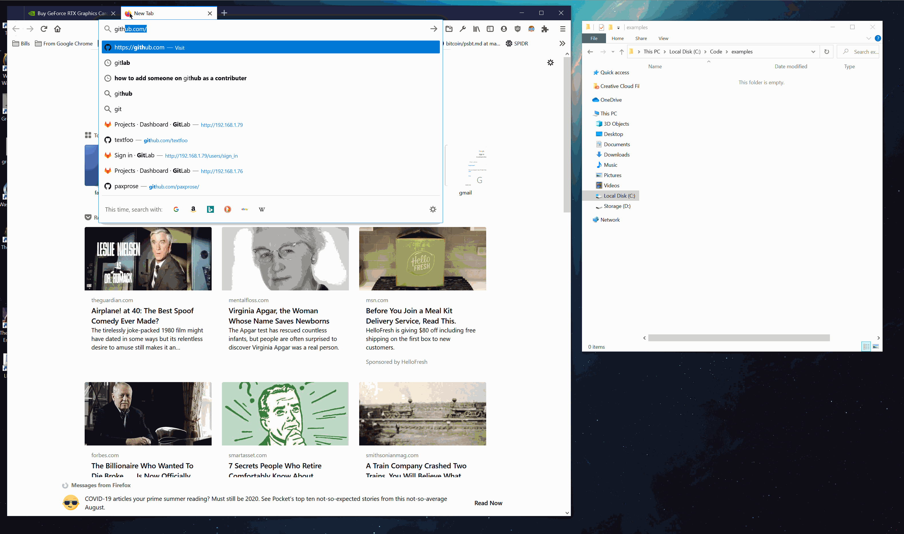

# open sourced scraper because a bunch of people were upset at nvidia

## this tool doesn't buy anything for you, it only opens up a webpage if it thinks it can.

## nvidia discord Overflow Rm 2

### instructions



Step 1 - make sure you have npm installed : https://www.npmjs.com/get-npm

Step 2 - clone back the repo

Step 3 - you have to install all the dependencies this thing needs in order to run

+ open up a new command terminal and naviagte to whatever folder the ```.index.js``` file is in
+ ```npm i```

Step 5 - see if you can run the thing

+ ```node index.js```

#### TODO's

+ ~~Only runs once and exits - put it it in a loop with some threadsleep behavior so you don't get locked out~~
  + tossed everything inside of a blocking event loop
+ Add more than just nvidia's website

### other notes

+ _i got banned from the nvidia discord, hit me up @ paxprose#1644_

## end
